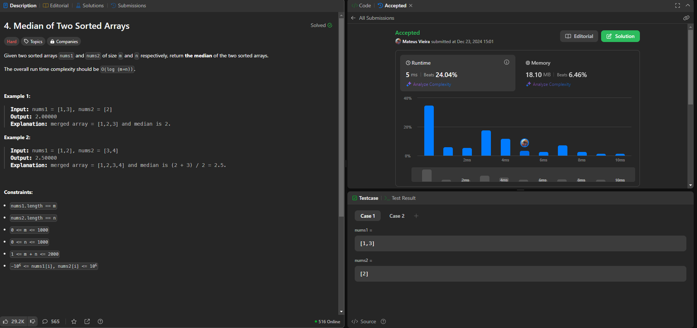
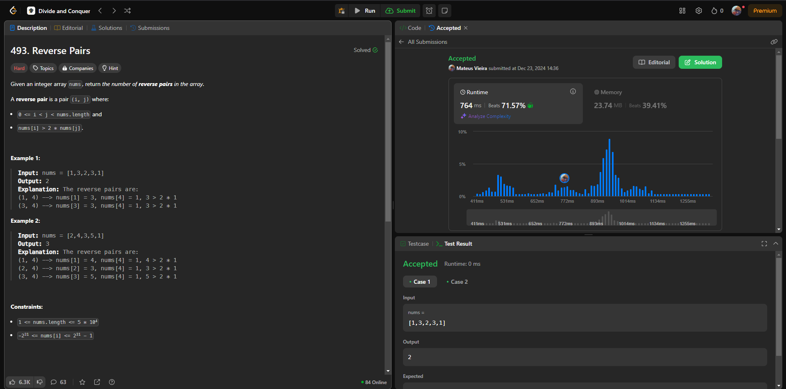
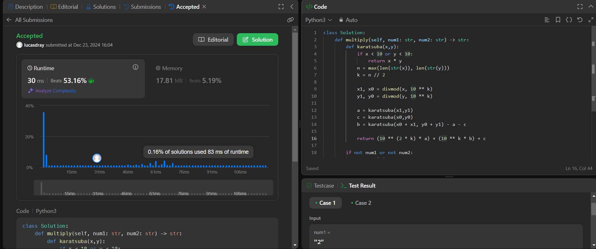

# Dividir e Conquistar - LeetCode_Problems

**Número da Lista**: 32
**Conteúdo da Disciplina**: Dividir e Conquistar

## Alunos

| Matrícula | Aluno                      |
| --------- | -------------------------- |
| 202016963 | Mateus Vinicius Vieira     |
| 211039680 | Pedro Lucas Dourado Santos |

## Sobre

Este projeto consiste na resolução de questões da plataforma LeetCode variando nas dificuldades de médio e difícil. O objetivo é utilizar o conteúdo em sala.

| Problema | Nome                                                                                                                                                   | Nível de Dificuldade |
| -------- | ------------------------------------------------------------------------------------------------------------------------------------------------------ | -------------------- |
| 493      | [Reverse Pairs](https://leetcode.com/problems/reverse-pairs/description/?envType=problem-list-v2&envId=divide-and-conquer)                             | Difícil              |
| 4        | [Median of Two Sorted Arrays](https://leetcode.com/problems/median-of-two-sorted-arrays/description/?envType=problem-list-v2&envId=divide-and-conquer) | Difícil              |
| 43       | [Multiply Strings](https://leetcode.com/problems/multiply-strings/description/)                                                                        | Média                |

## Screenshots

### [Reverse Pairs](./screenshots/Screenshot_Desafio_4.png)

### [Median of Two Sorted Arrays](./screenshots/Screenshot_Desafio_493.png)

### [Multiply Strings](./screenshots/Screenshot_Desafio_43.png)

## Linguagem Utilizada

- Python

## Uso

Entrar na plataforma [LeetCode](https://leetcode.com/), procurar pelo número do exercício, colar na aba code e clicar em Run

## Outros

[Vídeo de Apresentação](https://youtu.be/BuyIh5GABBU)
